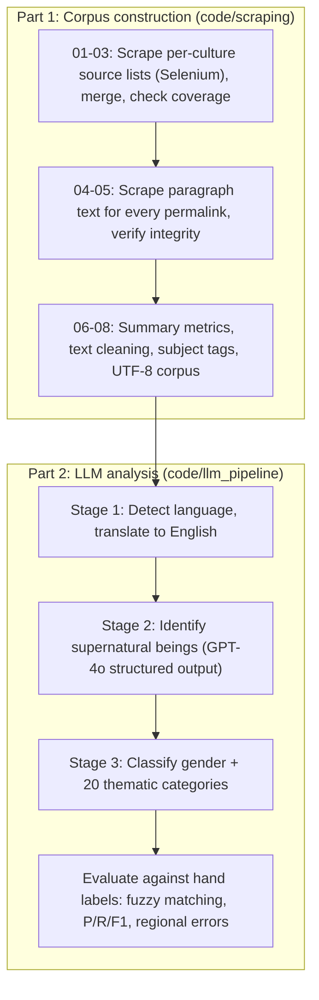
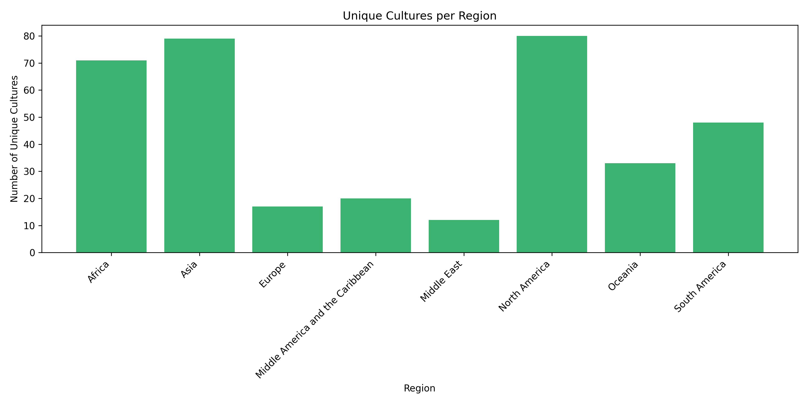
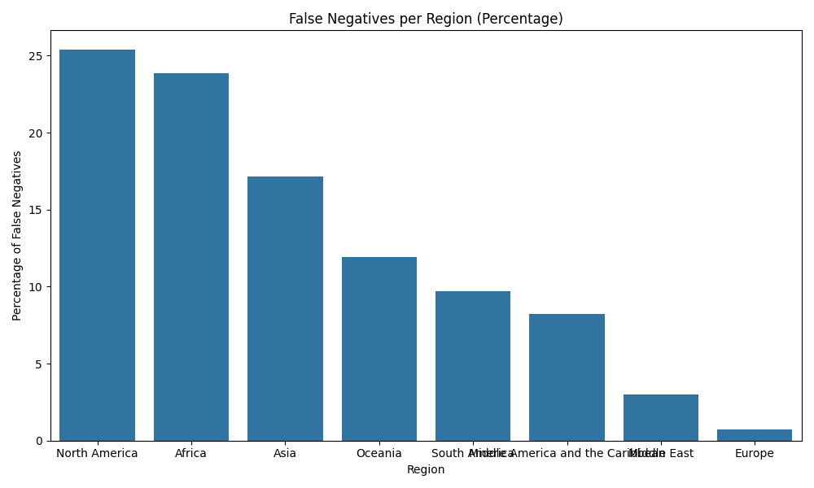

# eHRAF Deity Pipeline

Code for a research project on deities across world cultures, with a particular focus on female deities. The pipeline has two parts:

1. **Corpus construction**: scrape every religion-related paragraph in the [eHRAF World Cultures](https://ehrafworldcultures.yale.edu/) database (about 447,000 paragraphs across 361 cultures), along with citation metadata, region and subsistence classifications, and OCM subject tags.
2. **LLM analysis**: use GPT-4o with structured outputs (or Gemini as an alternative) to identify every supernatural being mentioned in each paragraph and classify it by gender and 20 thematic categories, then score the predictions against a hand-labeled sample using fuzzy name matching, precision/recall/F1, and regional error breakdowns.

Author: Aidan Li (aidanlli1411@gmail.com)

## Pipeline at a glance



## Repository structure

```
├── config.py                  # central path configuration; all scripts read/write via this
├── code/
│   ├── scraping/              # Part 1: numbered scripts 01-08, run in order
│   ├── llm_pipeline/          # Part 2: pipeline + evaluation modules and notebooks
│   │   ├── deity_analysis_utils.py    # 3-stage GPT-4o pipeline (Pydantic structured outputs)
│   │   ├── evaluation_utils.py        # fuzzy matching, metrics, evaluation plots
│   │   ├── row_metrics.py             # per-row TP/FP/FN and text-length statistics
│   │   ├── gemini_pipeline.py         # alternative single-prompt Gemini implementation
│   │   ├── 00_build_sample.ipynb      # document-level sampling from the corpus
│   │   ├── 01_run_pipeline.ipynb      # run the 3-stage pipeline end to end
│   │   ├── 02_evaluate_results.ipynb  # score predictions against ground truth
│   │   └── legacy/                    # pre-refactor single-prompt scripts, kept for reference
│   └── helpers/               # one-off data-repair utilities
├── notebooks/                 # exploratory language-ID (GlotLID) and translation (DeepL/NLLB) work
├── data/
│   ├── raw/                   # eHRAF culture list + manual exports (version-controlled)
│   ├── samples/               # 250-row labeled evaluation sample (metadata only, see below)
│   └── intermediate/          # large generated artifacts (git-ignored)
└── output/figures/            # generated tables and charts (dataset summary + evaluation)
```

## Data availability

eHRAF World Cultures is a subscription database maintained by the Human Relations Area Files (HRAF) at Yale University. The paragraph text is licensed, so this repository does not redistribute it. What is included:

| Included | Not included (regenerate locally) |
|---|---|
| Culture reference list (`data/raw/qrySummary_...csv`, from HRAF's public [culture list](https://hraf.yale.edu/resources/reference/)) | The full ~470 MB paragraph-text corpus |
| Manual source exports for five oversized cultures (metadata and permalinks only) | Paragraph text for the 250-row sample |
| The 250-row evaluation sample with citation metadata, subject tags, and permalinks (`data/samples/250_sampled_rows.csv`) | The hand-labeled deity/gender annotations tied to the licensed text |
| All generated summary tables and figures | |

If you have institutional eHRAF access, Part 1 below rebuilds the full corpus in about 11 hours. Every row of the shipped sample carries its `uuid` and `Permalink`, so the sample text re-attaches deterministically.

Note: the culture reference list was downloaded in January 2024. I manually added two cultures catalogued since then (Tarascans and Chiriguano); if you download a fresh copy from HRAF, update this accordingly.

## Setup

Requires Python 3.10+ and Google Chrome (for the Selenium scraper).

```bash
git clone https://github.com/aidanlli/ehraf-deity-pipeline.git
cd ehraf-deity-pipeline

# with uv
uv sync --extra scraping --extra llm          # add --extra translation for the notebooks/
# or with pip
pip install -e ".[scraping,llm]"

cp .env.example .env                          # then fill in the API keys you need
```

All file locations are defined in [`config.py`](config.py). Scripts read inputs from `data/` and write large artifacts to `data/intermediate/` (git-ignored) and figures to `output/figures/`, so no paths need editing to run the pipeline.

## Part 1: Corpus construction (`code/scraping/`)

Eight scripts, run in numeric order. Steps 01 and 04 are the long ones (roughly 3 and 8 hours); everything else is fast.

| Step | Script | What it does |
|---|---|---|
| 01 | `01_scrape_culture_sources.py` | For every culture, runs a subject-filtered eHRAF search (11 religion-related OCM subjects, e.g. mythology, spirits and gods, cosmology) via Selenium and exports each result grid to CSV. |
| 02 | `02_concatenate_sources.py` | Merges all per-culture CSVs into one master source list, de-duplicated by paragraph UUID. |
| 03 | `03_check_missing_cultures.py` | Diffs the master list against the official culture list and reports cultures that failed to download. |
| 04 | `04_scrape_paragraph_text.py` | Fetches every paragraph's permalink and appends `Raw Text` / `Text` columns. Resumable; saves every 1,000 rows. |
| 05 | `05_verify_dataframe.py` | Confirms no UUIDs were lost in step 04 and counts blank / "No text found" rows. |
| 06 | `06_summary_metrics.py` | Generates the dataset summary tables and charts (regions, cultures, doc types, gendered-keyword frequencies) in `output/figures/dataset_summary/`. |
| 07 | `07_clean_text_expand_subjects.py` | Strips eHRAF boilerplate from the text and expands the 11 OCM subject tags into binary indicator columns. |
| 08 | `08_fix_encoding.py` | Repairs latin-1 mojibake and writes the final UTF-8 corpus. |

```bash
python code/scraping/01_scrape_culture_sources.py
# move the browser-downloaded CSVs (plus data/raw/manual_culture_exports/*) into data/intermediate/ehraf_exports/
python code/scraping/02_concatenate_sources.py
python code/scraping/03_check_missing_cultures.py
# ...then 04 through 08 in order
```

Notes:

- To watch the scraper work, comment out `options.add_argument("--headless")` in step 01.
- Five cultures (Dogon, Navajo, Ifugao, Hopi, Zulu) exceed eHRAF's export limit; their pre-split exports ship in `data/raw/manual_culture_exports/`.
- Step 03 is expected to report five cultures that exist in the reference list but have no scrapeable results (Dominicans, Eastern Apache, Turkmens, Hazara, Pamir Peoples). Any other missing culture should be pasted into the retry list in step 01 and re-run through steps 01-03 until only those five remain.
- After step 05, `Raw Text` should have no blank rows and only a handful of "No text found" entries (13 as of February 2025). Substantially more than that indicates a scraping problem; spot-check the permalinks before proceeding.
- In step 06's tables, the "Total" rows for Region, Subregion, Subsistence, Culture, and DocType should all agree.

The finished corpus is a ~470 MB UTF-8 CSV: one row per paragraph with citation metadata, region/subsistence classifications, permalink, cleaned text, and 11 binary subject-tag columns.

## Part 2: LLM identification and classification (`code/llm_pipeline/`)

A three-stage pipeline over sampled paragraphs, orchestrated by [`deity_analysis_utils.py`](code/llm_pipeline/deity_analysis_utils.py) and driven from [`01_run_pipeline.ipynb`](code/llm_pipeline/01_run_pipeline.ipynb):

1. **Translation**: `langdetect` plus an ASCII-share heuristic decide whether a paragraph needs translating; non-English text is translated with `deep-translator`.
2. **Identification**: GPT-4o (`client.beta.chat.completions.parse`, temperature 0) extracts every supernatural being, alternative names, and a 0-100 certainty score into a Pydantic `DeityIdentification` schema. The prompts restrict the model to evidence in the paragraph itself, with no outside mythological knowledge.
3. **Classification**: for each identified being, a second structured call (`DeityClassification`) assigns gender (with certainty), individual/multiple type, an inception-myth flag, and 20 binary thematic categories.

<details>
<summary>The 20 classification categories</summary>

`cat_creator_universe`, `cat_creator_human`, `cat_mother`, `cat_wife`, `cat_primal`, `cat_omni`, `cat_present`, `cat_absent`, `cat_warrior`, `cat_nature`, `cat_cosmos`, `cat_death`, `cat_ruler`, `cat_dual`, `cat_trick`, `cat_evil`, `cat_good`, `cat_demigod`, `cat_inter`, `cat_object_force` -- covering creator/mother/wife roles, presence vs. distance, domains (nature, cosmos, death, rulership), moral valence, tricksters, demigods and ancestors, human intermediaries, and sacred objects/forces.

</details>

Evaluation ([`evaluation_utils.py`](code/llm_pipeline/evaluation_utils.py), driven from [`02_evaluate_results.ipynb`](code/llm_pipeline/02_evaluate_results.ipynb)) scores predictions against a hand-labeled ground truth: greedy one-to-one fuzzy name matching (`token_sort_ratio`, threshold 50) with alias support, TP/FP/FN and precision/recall/F1/accuracy, per-gender match and accuracy tables, category-distribution comparison with two-proportion z-tests, and FP/FN breakdowns by region and subregion. [`row_metrics.py`](code/llm_pipeline/row_metrics.py) appends per-row match rates and error counts normalized by text length for bulk analysis.

Two alternatives are included for comparison:

- [`gemini_pipeline.py`](code/llm_pipeline/gemini_pipeline.py): the same task as a single combined prompt against Gemini 2.5 Flash, with batch checkpointing and resumption.
- [`code/llm_pipeline/legacy/`](code/llm_pipeline/legacy/): the original single-prompt GPT approach, kept for reference. The staged pipeline above replaced it.

The exploratory notebooks in [`notebooks/`](notebooks/) prototype a higher-fidelity translation stage: language identification with GlotLID (fastText) and translation via DeepL with an NLLB-200 fallback for low-resource languages (e.g. Southern Kalinga, Balangao, Amganad Ifugao), plus a structured-output rewrite of the extraction stage.

### Running Part 2

API keys are read from `.env` (see `.env.example`). Programmatic use mirrors the notebooks:

```python
import openai
import pandas as pd

from deity_analysis_utils import (
    process_classification_stage,
    process_identification_stage,
    process_translation_stage,
)

df = pd.read_csv("data/intermediate/your_sample_with_text.csv")
client = openai.OpenAI()  # uses OPENAI_API_KEY

translation_df = process_translation_stage(df, text_column="Text", threshold=70.0)
identification_df = process_identification_stage(translation_df, client)
classification_df = process_classification_stage(df, translation_df, identification_df, client)
```

The full run on the 250-row sample takes roughly an hour, almost all of it API calls.

## Outputs

Part 1 produces the corpus plus 8 summary tables, 8 bar charts, and a histogram in [`output/figures/dataset_summary/`](output/figures/dataset_summary/). Part 2 produces stage-wise CSVs, overall and per-gender metric tables, and the regional/category evaluation charts in [`output/figures/evaluation/`](output/figures/evaluation/).

| Corpus coverage by region | Identification errors by region |
|---|---|
|  |  |

## License

Code is released under the [MIT License](LICENSE). The eHRAF World Cultures data that the pipeline processes remains subject to HRAF's licensing terms and is not distributed with this repository.
